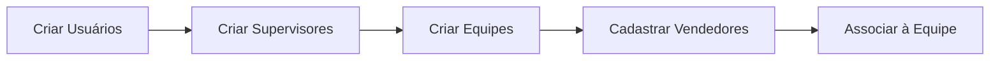
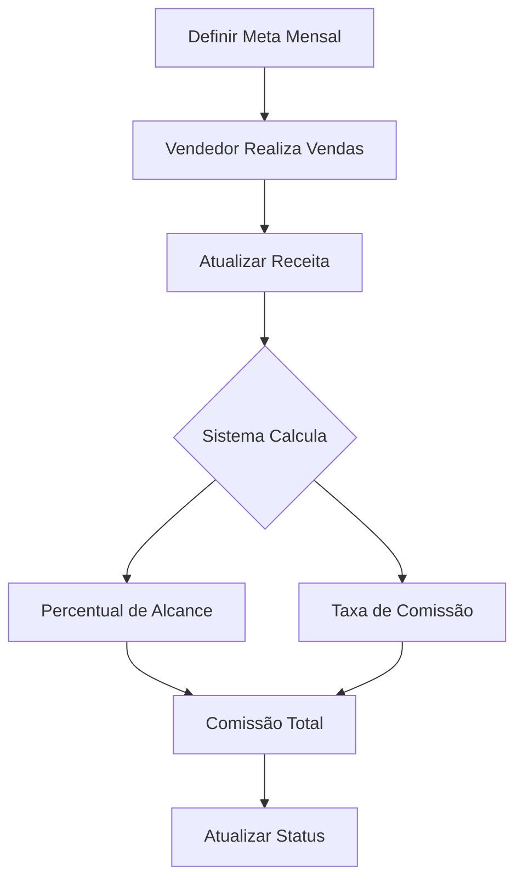

# 📋 GUIA COMPLETO DO SISTEMA

## 🎯 Visão Geral

Este sistema permite gerenciar todo o ciclo de vendas, desde a criação de equipes até o cálculo automático de comissões baseado no desempenho dos vendedores.

## 👥 Hierarquia do Sistema

```
┌─────────────────────┐
│   ADMINISTRADOR     │  ← Acesso total ao sistema
└──────────┬──────────┘
           │
           ├──────────────────────────────────┐
           │                                  │
    ┌──────▼──────┐                  ┌───────▼──────┐
    │ SUPERVISOR 1│                  │ SUPERVISOR 2 │
    └──────┬──────┘                  └───────┬──────┘
           │                                 │
    ┌──────┴──────┐              ┌──────────┴──────┐
    │             │              │                 │
┌───▼────┐   ┌───▼────┐     ┌───▼────┐      ┌────▼─────┐
│Equipe 1│   │Equipe 2│     │Equipe 3│      │ Equipe 4 │
└───┬────┘   └───┬────┘     └───┬────┘      └────┬─────┘
    │            │              │                │
┌───▼──┐    ┌───▼──┐       ┌───▼──┐        ┌────▼───┐
│Vend 1│    │Vend 3│       │Vend 5│        │ Vend 7 │
├──────┤    ├──────┤       ├──────┤        ├────────┤
│Vend 2│    │Vend 4│       │Vend 6│        │ Vend 8 │
└──────┘    └──────┘       └──────┘        └────────┘
```

## 🔄 Fluxo de Trabalho

### 1️⃣ Configuração Inicial



**Passo a Passo:**
1. **Admin cria usuários supervisores**
   - Menu: Registro → Criar conta
   - Cargo: Supervisor
   
2. **Admin ou Supervisor cria equipes**
   - Menu: Equipes → Nova Equipe
   - Define nome, descrição e supervisor responsável
   
3. **Cadastra vendedores**
   - Menu: Vendedores → Novo Vendedor
   - Preenche dados pessoais
   - Associa a supervisor e equipe

### 2️⃣ Gestão de Metas



**Passo a Passo:**
1. **Criar meta para vendedor**
   - Menu: Metas → Nova Meta
   - Seleciona vendedor e período (mês/ano)
   - Define valor da meta (ex: R$ 50.000,00)
   - Receita inicial pode ser R$ 0,00

2. **Acompanhar vendas**
   - Vendedor realiza vendas no mês
   - Atualizar campo "Receita Alcançada"
   - Sistema recalcula comissão automaticamente

3. **Aprovar pagamento**
   - Status: Pendente → Aprovado → Pago
   - Filtrar metas por status

### 3️⃣ Cálculo de Comissão

O sistema calcula automaticamente baseado na performance:

| Performance | Taxa | Exemplo (Receita R$ 60.000) |
|-------------|------|----------------------------|
| 0-50%       | 1%   | R$ 600,00                  |
| 51-75%      | 2%   | R$ 1.200,00                |
| 76-100%     | 3%   | R$ 1.800,00                |
| 101-125%    | 4%   | R$ 2.400,00                |
| 125%+       | 5%   | R$ 3.000,00                |

**Exemplo Prático:**
```
Meta: R$ 50.000,00
Receita Alcançada: R$ 60.000,00
Percentual: 120% (60.000 / 50.000 * 100)
Faixa: 101-125% → Taxa 4%
Comissão: R$ 60.000 × 4% = R$ 2.400,00
```

## 📊 Funcionalidades por Tela

### 🏠 Dashboard
- **Estatísticas Globais:**
  - Total de vendedores ativos
  - Receita total do mês
  - Meta total do mês
  - Comissões totais
  
- **Ranking de Vendedores:**
  - Ordenado por percentual de alcance
  - Barras de progresso coloridas
  - Comissão individual

### 👥 Vendedores
- **Lista de Vendedores:**
  - Visualizar todos vendedores
  - Filtrar por equipe
  - Ver supervisor e equipe
  - Editar/Desativar

- **Cadastro/Edição:**
  - Dados pessoais (nome, email, telefone, CPF)
  - Máscara automática para telefone e CPF
  - Seleção de supervisor
  - Seleção de equipe

### 🏢 Equipes
- **Lista de Equipes:**
  - Cards com informações resumidas
  - Total de vendedores por equipe
  - Nome do supervisor
  - Botões de ação (Detalhes/Editar/Desativar)

- **Detalhes da Equipe:**
  - Informações da equipe
  - Lista de vendedores com suas metas
  - Performance individual
  - Estatísticas consolidadas

- **Cadastro/Edição:**
  - Nome da equipe
  - Descrição
  - Supervisor responsável

### 🎯 Metas
- **Lista de Metas:**
  - Filtro por mês e ano
  - Estatísticas do período
  - Tabela com todas metas
  - Status de comissão
  - Barras de progresso

- **Cadastro/Edição:**
  - Seleção de vendedor
  - Período (mês/ano)
  - Valor da meta
  - Receita alcançada
  - Preview de comissão em tempo real
  - Status (Pendente/Aprovado/Pago)
  - Observações

## 🎨 Código de Cores

### Barras de Progresso
- 🔴 **Vermelho** (0-50%): Abaixo da média
- 🟡 **Amarelo** (51-75%): Em desenvolvimento
- 🔵 **Azul** (76-100%): Meta atingida
- 🟢 **Verde Claro** (101-125%): Superou meta
- 🟢 **Verde Escuro** (125%+): Performance excepcional

### Status de Comissão
- 🔵 **Azul** - Pendente: Aguardando aprovação
- 🟢 **Verde** - Aprovado: Liberado para pagamento
- ⚫ **Cinza** - Pago: Comissão já foi paga

## 📱 Responsividade

O sistema é totalmente responsivo e se adapta a:

- 💻 **Desktop** (1920px+): Layout completo com 3-4 colunas
- 💻 **Laptop** (1366px): Layout com 2-3 colunas
- 📱 **Tablet** (768px): Layout com 1-2 colunas
- 📱 **Mobile** (320px+): Layout em coluna única

## 🔐 Níveis de Acesso

### Administrador
- ✅ Criar/editar/deletar usuários
- ✅ Criar/editar/deletar equipes
- ✅ Criar/editar/deletar vendedores
- ✅ Criar/editar/deletar metas
- ✅ Aprovar/rejeitar comissões
- ✅ Acesso total ao dashboard

### Supervisor
- ✅ Ver vendedores de suas equipes
- ✅ Criar/editar metas de sua equipe
- ✅ Atualizar receitas alcançadas
- ✅ Ver dashboard filtrado por suas equipes
- ❌ Não pode gerenciar outros supervisores

### Usuário
- ✅ Ver dashboard geral
- ✅ Ver lista de vendedores
- ❌ Não pode editar dados
- ❌ Não pode criar metas

## 🚀 Casos de Uso Comuns

### Caso 1: Nova Equipe de Vendas
```
1. Admin cria novo supervisor
2. Admin cria nova equipe e associa ao supervisor
3. Supervisor cadastra vendedores na equipe
4. Supervisor define metas mensais para cada vendedor
5. Sistema acompanha performance automaticamente
```

### Caso 2: Fechamento Mensal
```
1. Supervisor atualiza receitas alcançadas
2. Sistema calcula comissões automaticamente
3. Admin revisa e aprova comissões
4. Admin marca comissões como pagas
5. Próximo mês: criar novas metas
```

### Caso 3: Acompanhamento Diário
```
1. Acessa Dashboard
2. Verifica ranking de vendedores
3. Identifica vendedores abaixo da meta
4. Toma ações para melhorar performance
5. Atualiza receitas conforme vendas acontecem
```

## 📞 Suporte

Para dúvidas ou problemas:
1. Verifique este guia primeiro
2. Consulte o README.md para detalhes técnicos
3. Teste com os dados de exemplo (init_data.py)

## 🎓 Dicas de Uso

### ✨ Melhores Práticas

1. **Organize por Equipes**
   - Agrupe vendedores por região ou produto
   - Facilita acompanhamento e comparações

2. **Defina Metas Realistas**
   - Baseie em histórico de vendas
   - Considere sazonalidade

3. **Atualize Receitas Regularmente**
   - Preferencialmente semanal
   - Vendedores acompanham progresso

4. **Use Observações**
   - Documente eventos importantes
   - Justifique ajustes de meta

5. **Aprove Comissões Mensalmente**
   - Mantenha fluxo de caixa organizado
   - Evite acúmulo de pendências

### ⚡ Atalhos Úteis

- **Dashboard:** Visão rápida de tudo
- **Equipes → Detalhes:** Performance completa da equipe
- **Metas → Filtros:** Análise histórica
- **Vendedores → Lista:** Gestão centralizada

## 📈 Análises Disponíveis

1. **Performance Individual**
   - Dashboard mostra ranking
   - Detalhes da equipe mostra cada vendedor

2. **Performance por Equipe**
   - Página de detalhes da equipe
   - Estatísticas consolidadas

3. **Histórico Mensal**
   - Filtro de metas por período
   - Comparação mês a mês

4. **Distribuição de Comissões**
   - Dashboard mostra total
   - Lista de metas mostra por status
